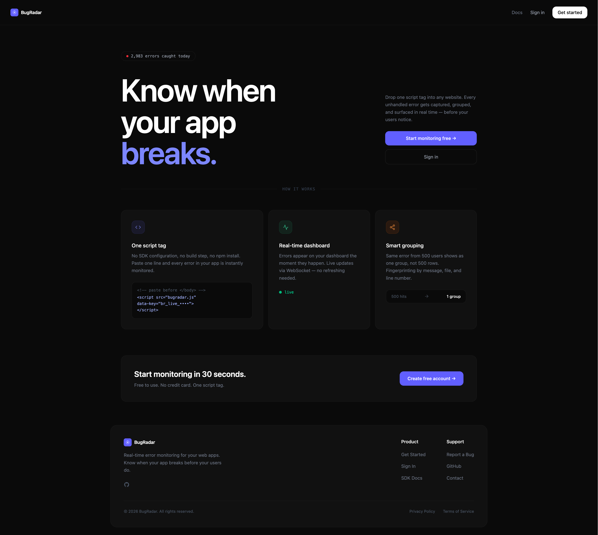
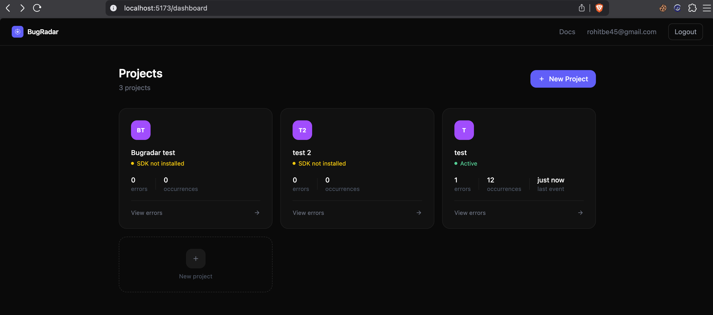
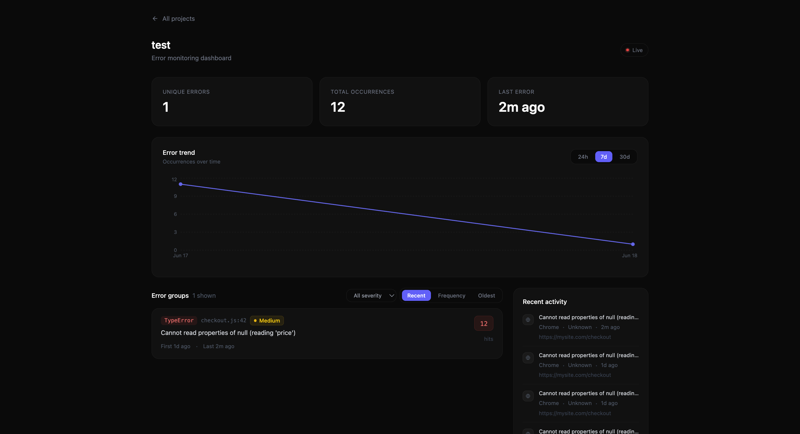
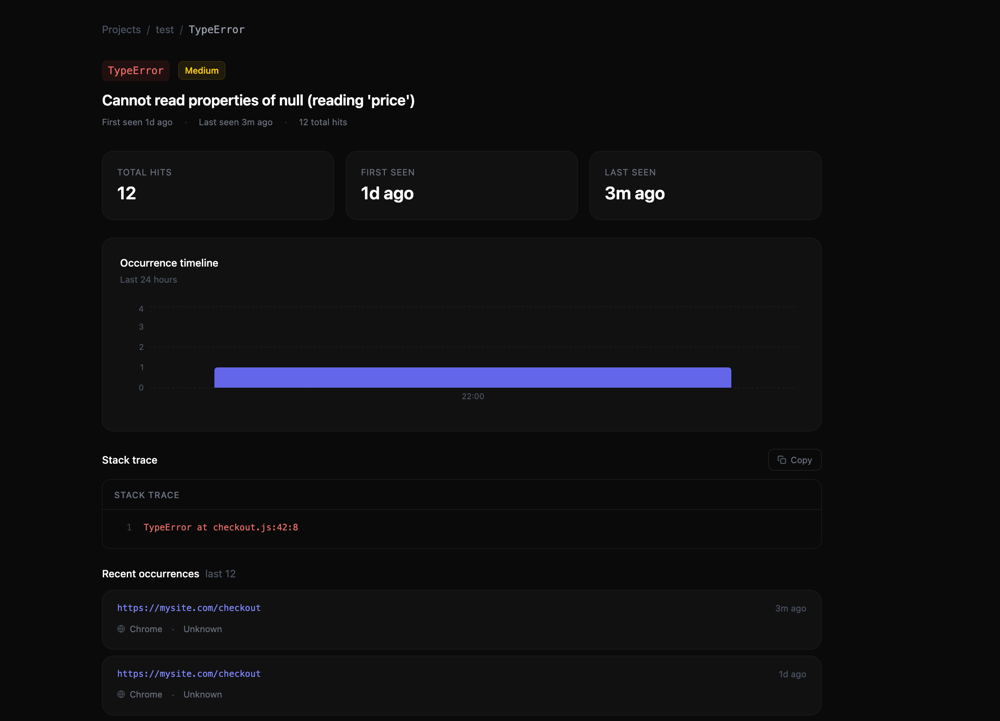
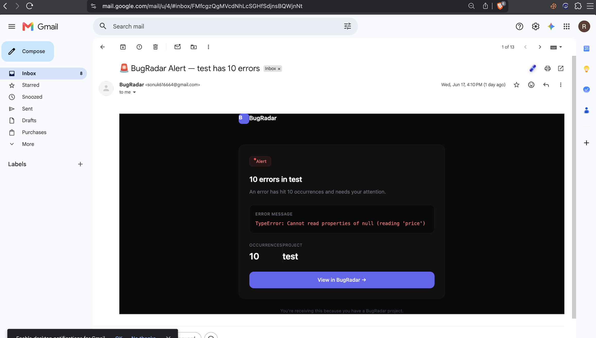
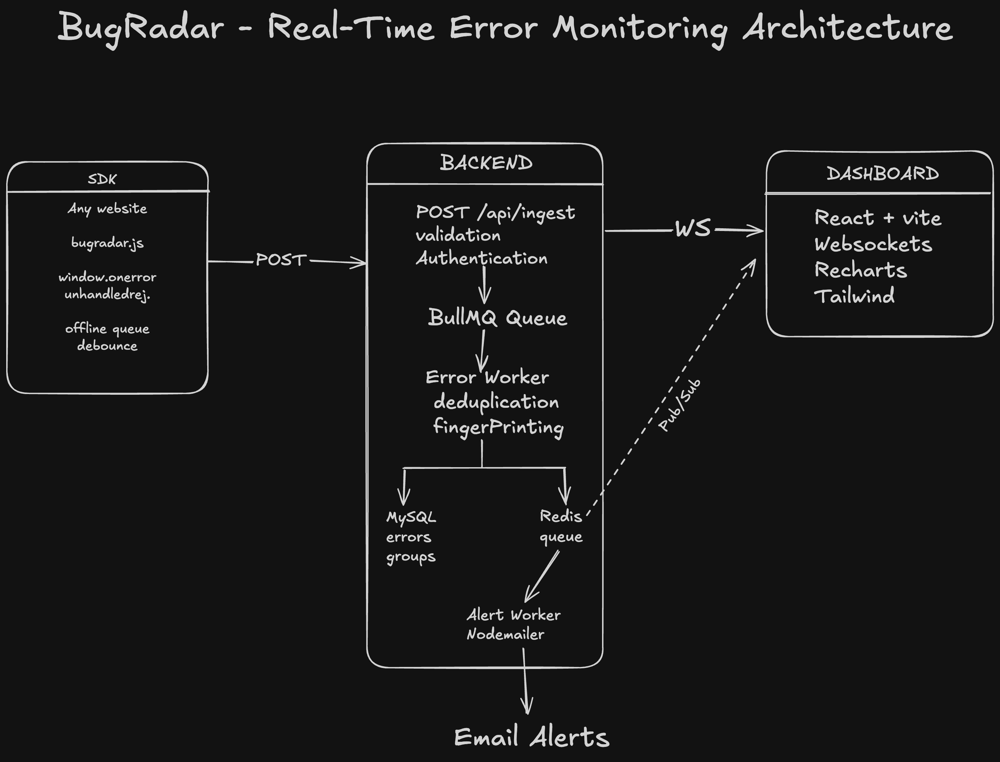

# BugRadar

Real-time error monitoring for web applications. Drop one script tag into any website and every unhandled JavaScript error gets captured, grouped, and surfaced on a live dashboard — before your users notice.

<!--
  HERO IMAGE: Full-width screenshot of the landing page
  Recommended: 1200x600px
  Tool: Use browser fullscreen (F11) + screenshot
  Save as: assets/hero.png
-->



---

## Demo

<!--
  DEMO VIDEO: 2-3 minute screen recording showing:
  1. Landing page
  2. Creating a project + copying API key
  3. Triggering an error from the demo page
  4. Watching it appear live on the dashboard (the wow moment)
  5. Clicking the error → detail page with stack trace
  6. Email alert arriving

  Tool: Loom (free) or QuickTime on Mac
  Upload to: YouTube (unlisted) or Loom
  Then replace the URL below
-->

[](https://www.youtube.com/watch?v=YOUR_VIDEO_ID)

> Click the image above to watch the demo

---

## Features

- **One script tag install** — no npm, no build step, no configuration
- **Real-time dashboard** — errors appear live via WebSocket
- **Smart grouping** — same error from 500 users shows as one group, not 500 rows
- **Severity classification** — auto-assigned Critical / High / Medium / Low
- **Error trend charts** — 24h / 7d / 30d occurrence timeline
- **Browser distribution** — see which browsers are affected
- **Email alerts** — notified when errors cross thresholds (10 / 50 / 100 hits)
- **Stack trace viewer** — full expandable stack trace with copy button
- **Offline queue** — SDK stores errors when offline, flushes on reconnect

---

## Screenshots

### Landing page

<!--
  SCREENSHOT: Landing page at localhost:5173
  Show the full page including hero, features section, CTA banner
  Save as: assets/landing.png
-->


### Projects dashboard

<!--
  SCREENSHOT: Projects page with 2-3 projects showing
  Make sure at least one shows "Active" status with error counts
  Save as: assets/projects.png
-->



### Error monitoring dashboard

<!--
  SCREENSHOT: Project error dashboard with real data
  Should show: stats row, trend chart, error groups list, activity feed, browser distribution
  Save as: assets/dashboard.png
-->



### Error detail page

<!--
  SCREENSHOT: Error detail page showing stack trace + occurrence timeline
  Make sure the stack trace is expanded
  Save as: assets/error-detail.png
-->



### Email alert

<!--
  SCREENSHOT: The email alert in Gmail
  Crop to just the email body, not the full Gmail UI
  Save as: assets/email-alert.png
-->



---

## Architecture

```
Browser (SDK)          Backend                    Frontend
─────────────          ───────────────────────    ──────────────
window.onerror    →    POST /api/ingest       →   React dashboard
unhandledrejection     BullMQ queue               WebSocket updates
                       Worker (dedup + store)      Recharts charts
                       Redis pub/sub          →   Live updates
                       MySQL storage
                       Email alerts (Nodemailer)
```

<!--
  ARCHITECTURE DIAGRAM (optional but impressive):
  Draw a clean version of the above using Excalidraw (excalidraw.com)
  Export as PNG and save as: assets/architecture.png
  Then uncomment the line below:
-->
<!--  -->

---

## Tech Stack

| Layer           | Technology                          |
| --------------- | ----------------------------------- |
| Frontend        | React, Vite, Tailwind CSS, Recharts |
| Backend         | Node.js, Express                    |
| Queue           | BullMQ (Redis-backed)               |
| Database        | MySQL                               |
| Cache / Pub-sub | Redis                               |
| Auth            | JWT (httpOnly cookies)              |
| Email           | Nodemailer (Gmail SMTP)             |
| SDK             | Vanilla JS (no dependencies)        |

---

## Getting Started

### Prerequisites

- Node.js 18+
- MySQL 8+
- Redis 7+

### 1. Clone the repo

```bash
git clone https://github.com/Sonu99kr/bugradar.git
cd bugradar
```

### 2. Set up the database

```bash
mysql -u root -p < server/schema.sql
```

### 3. Configure environment

```bash
cp server/.env.example server/.env
# Fill in your DB credentials, Redis URL, JWT secret, Gmail credentials
```

### 4. Install dependencies

```bash
cd server && npm install
cd ../client && npm install
```

### 5. Start the servers

```bash
# Terminal 1 — backend
cd server && npm run dev

# Terminal 2 — frontend
cd client && npm run dev
```

### 6. Install the SDK on any website

```html
<script
  src="http://localhost:5020/sdk/bugradar.js"
  data-key="YOUR_PROJECT_API_KEY"
  data-endpoint="http://localhost:5020/api/ingest"
></script>
```

---

## Project Structure

```
bugradar/
├── server/
│   ├── src/
│   │   ├── config/        # DB, Redis, queue, mailer
│   │   ├── middleware/     # Auth, validation, sanitization
│   │   ├── routes/        # Auth, projects, ingest
│   │   ├── workers/       # Error worker, alert worker
│   │   ├── utils/         # Fingerprint, email templates
│   │   └── websocket.js   # WebSocket + Redis pub/sub
│   └── sdk/
│       └── bugradar.js    # Client SDK
├── client/
│   └── src/
│       ├── pages/         # Landing, Login, Signup, Projects, Dashboard, ErrorDetail
│       ├── components/    # Navbar, Footer, Layout, ProtectedRoute
│       ├── hooks/         # useAuth, useWebSocket
│       ├── context/       # AuthContext
│       └── api/           # Axios instance
└── README.md
```

---

## API Reference

| Method | Endpoint                            | Description                 |
| ------ | ----------------------------------- | --------------------------- |
| POST   | `/api/auth/signup`                  | Create account              |
| POST   | `/api/auth/login`                   | Login                       |
| GET    | `/api/auth/me`                      | Get current user            |
| POST   | `/api/auth/logout`                  | Logout                      |
| GET    | `/api/projects`                     | List projects with stats    |
| POST   | `/api/projects`                     | Create project              |
| PATCH  | `/api/projects/:id`                 | Rename project              |
| DELETE | `/api/projects/:id`                 | Delete project              |
| POST   | `/api/projects/:id/regenerate-key`  | Regenerate API key          |
| GET    | `/api/projects/:id/errors`          | List error groups           |
| GET    | `/api/projects/:id/errors/:errorId` | Error detail                |
| GET    | `/api/projects/:id/trend`           | Error trend data            |
| GET    | `/api/projects/:id/occurrences`     | Recent occurrences          |
| GET    | `/api/projects/:id/browsers`        | Browser distribution        |
| POST   | `/api/ingest`                       | Ingest error (SDK endpoint) |

---

## Security

- Passwords hashed with bcrypt (12 rounds)
- API keys hashed with SHA-256 before storage
- JWT stored in httpOnly cookies (XSS-proof)
- Input sanitization against stored XSS
- Ownership checks on all project/error routes (IDOR prevention)
- Rate limiting on ingestion endpoint
- Helmet.js security headers

---

## Author

Sonu Kumar — [GitHub](https://github.com/Sonu99kr) · [LinkedIn](https://www.linkedin.com/in/sonukr1/)
